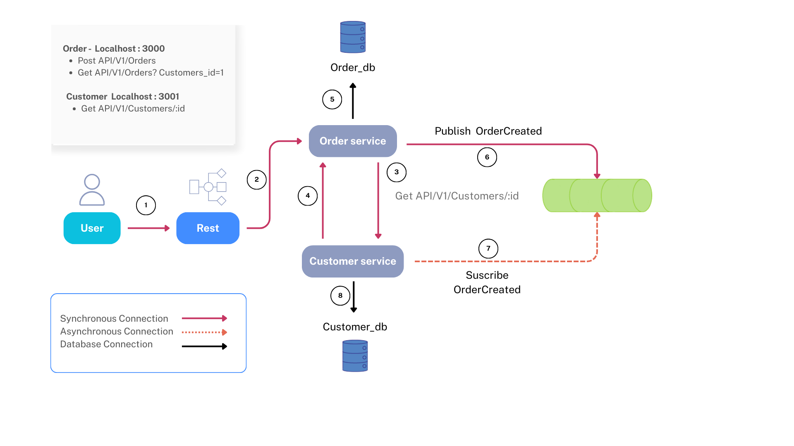

# Arquitectura de Microservicios con Docker Compose

Este proyecto implementa una arquitectura de microservicios que gestiona **órdenes** y **clientes**, utilizando **PostgreSQL** como base de datos y **RabbitMQ** como sistema de mensajería para comunicación asincrónica.

---

## Diagrama de Arquitectura



---

## Servicios incluidos

| Servicio             | Puerto Expuesto | Descripción |
|----------------------|-----------------|-------------|
| **order-service**    | `3000`          | API REST para crear y consultar órdenes. |
| **customer-service** | `3001`          | API REST para gestionar clientes. |
| **order-db**         | interno         | Base de datos PostgreSQL para órdenes. |
| **customer-db**      | interno         | Base de datos PostgreSQL para clientes. |
| **rabbitmq**         | `5672`, `15672` | Broker de mensajería con panel de administración en `http://localhost:15672`. |
| **customer-consumer**| interno         | Servicio consumidor que escucha eventos `OrderCreated` desde RabbitMQ y actualiza la base de datos de clientes. |

---

## Endpoints principales

- **Order Service (localhost:3000)**
  - `POST /api/v1/orders` → Crear una nueva orden.
  - `GET /api/v1/orders?customer_id=1` → Consultar órdenes por cliente.

- **Customer Service (localhost:3001)**
  - `GET /api/v1/customers/:id` → Obtener información de un cliente.

---

## Requisitos previos

- Docker y Docker Compose instalados.
- Puertos `3000`, `3001`, `5672`, `15672` disponibles en tu máquina.

---

## Levantar el proyecto

```bash
docker-compose up --build
